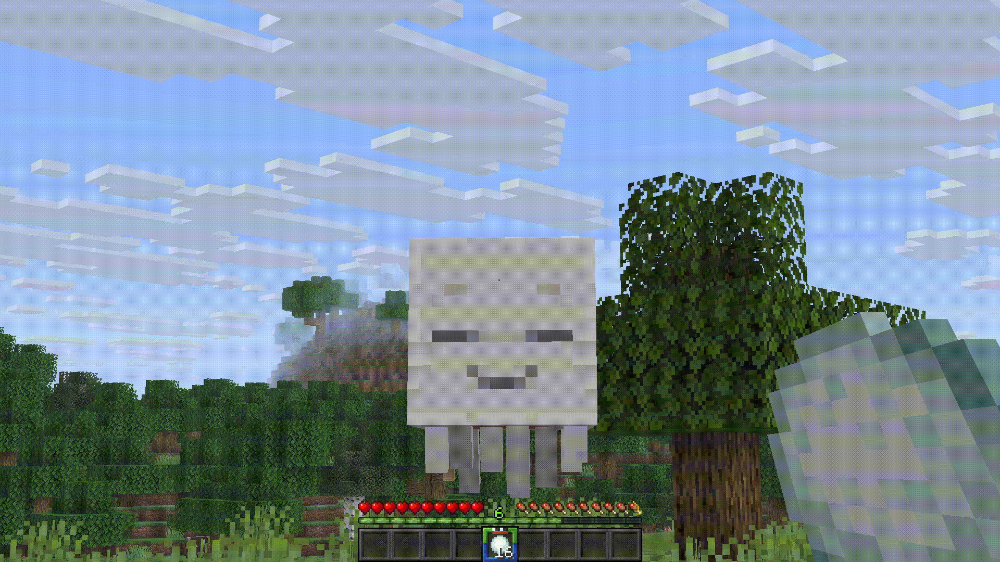

# 👻 Ghasts & Ghastlings

## Healing

Also on the server it is possible to heal your ghasts faster

<figure><figcaption></figcaption></figure>

***

## Hatching

If the ghast was hatched according to the scheme below, then its characteristics will be slightly changed:  `Scale 1.0 ➡ 0.25; speed 0.05 ➡ 0.115`

<figure><figcaption></figcaption></figure>

