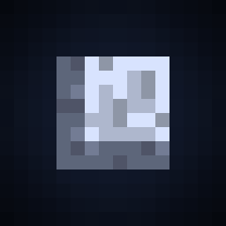
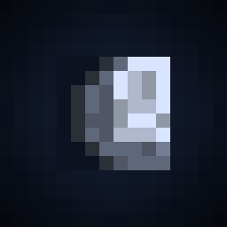
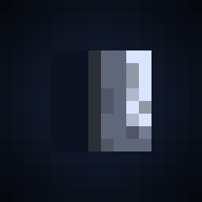
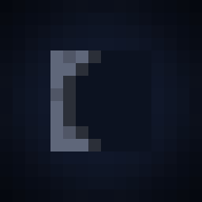
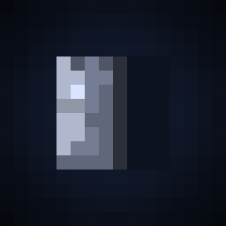
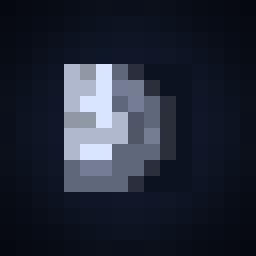

# 🌔 Phantoms

Now the size of phantoms directly depends on the current phase of the moon in the world

<table>
  <thead>
    <tr>
      <th width="125">Phase</th>
      <th width="128">Preview</th>
      <th width="135">Size multiplier</th>
    </tr>
  </thead>
  <tbody>
    <tr>
      <td>Full moon</td>
      <td></img></td>
      <td>2.0</td>
    </tr>
    <tr>
      <td>Waning gibbous</td>
      <td></td>
      <td>1.75</td>
    </tr>
    <tr>
      <td>Last quarter</td>
      <td></td>
      <td>1.5</td>
    </tr>
    <tr>
      <td>Waning crescent</td>
      <td></td>
      <td>1.25</td>
    </tr>
    <tr>
      <td>New moon</td>
      <td></td>
      <td>1.0</td>
    </tr>
    <tr>
      <td>Waxing crescent</td>
      <td></td>
      <td>1.25</td>
    </tr>
    <tr>
      <td>First quarter</td>
      <td></td>
      <td>1.5</td>
    </tr>
    <tr>
      <td>Waxing gibbous</td>
      <td></td>
      <td>1.75</td>
    </tr>
  </tbody>
</table>
