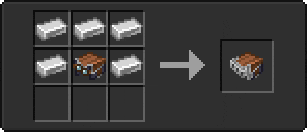
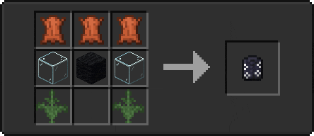

# 🤠 Harnesses

<table>
  <thead>
    <tr>
      <th width="150">Name</th>
      <th width="100">Item Preview</th>
      <th width="128" align="center">Equipment Preview</th>
      <th width="264">Crafting Recipe</th>
    </tr>
  </thead>
  <tbody>
    <tr>
      <td>Armored Harness</td>
      <td></td>
      <td align="center"></td>
      <td></td>
    </tr>
    <tr>
      <td>Hawaii Harness</td>
      <td></td>
      <td align="center"></td>
      <td></td>
    </tr>
  </tbody>
</table>
