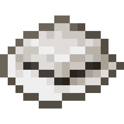
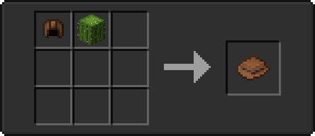
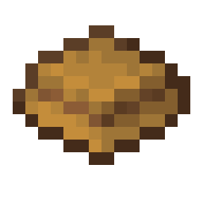
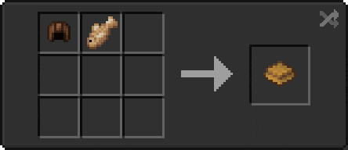
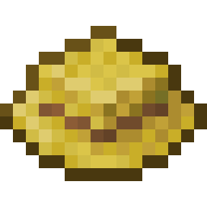
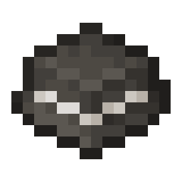
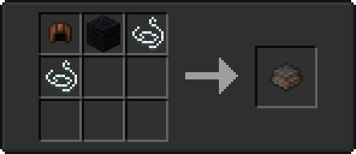

# 🎩 Hats

<table>
  <thead>
    <tr>
      <th width="150">Name</th>
      <th width="100">Item Preview</th>
      <th width="128" align="center">Model Preview</th>
      <th width="264">Crafting Recipe</th>
      <th width="110" data-type="checkbox">Is Dyeable?</th>
    </tr>
  </thead>
  <tbody>
    <tr>
      <td>Cowboy Hat</td>
      <td></td>
      <td align="center">-</td>
      <td></td>
      <td>true</td>
    </tr>
    <tr>
      <td>Fisherman Hat</td>
      <td></td>
      <td align="center">-</td>
      <td></td>
      <td>false</td>
    </tr>
    <tr>
      <td>Straw Hat</td>
      <td></td>
      <td align="center">-</td>
      <td></td>
      <td>false</td>
    </tr>
    <tr>
      <td>Top Hat</td>
      <td></td>
      <td align="center">-</td>
      <td></td>
      <td>true</td>
    </tr>
  </tbody>
</table>