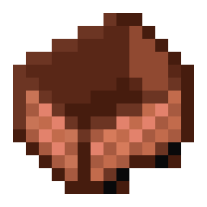
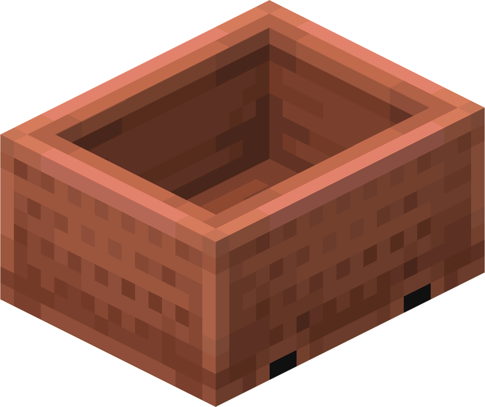
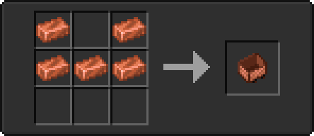
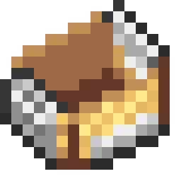
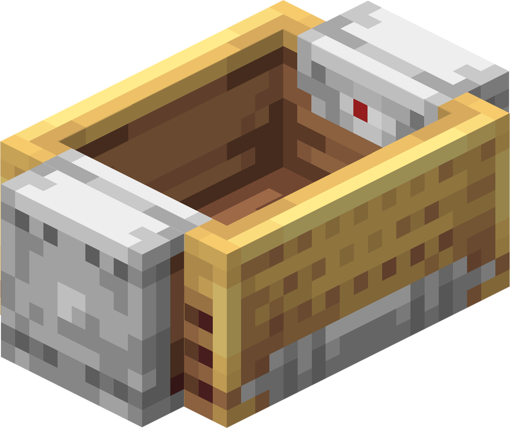
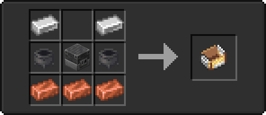

# 🛒 Minecarts

<table>
  <thead>
    <tr>
      <th width="125">Name</th>
      <th width="100">Item</th>
      <th width="128" align="center">Model</th>
      <th width="264">Crafting Recipe</th>
      <th width="70" align="center">Max Speed</th>
      <th width="70" align="center">Brakes Power</th>
    </tr>
  </thead>
  <tbody>
    <tr>
      <td>Copper Minecart</td>
      <td></td>
      <td align="center"></img></td>
      <td></td>
      <td>12.8 m/s</td>
      <td>0.23</td>
    </tr>
    <tr>
      <td>Steam Minecart</td>
      <td></td>
      <td align="center"></img></td>
      <td></td>
      <td>22.0 m/s</td>
      <td>0.5</td>
    </tr>
  </tbody>
</table>