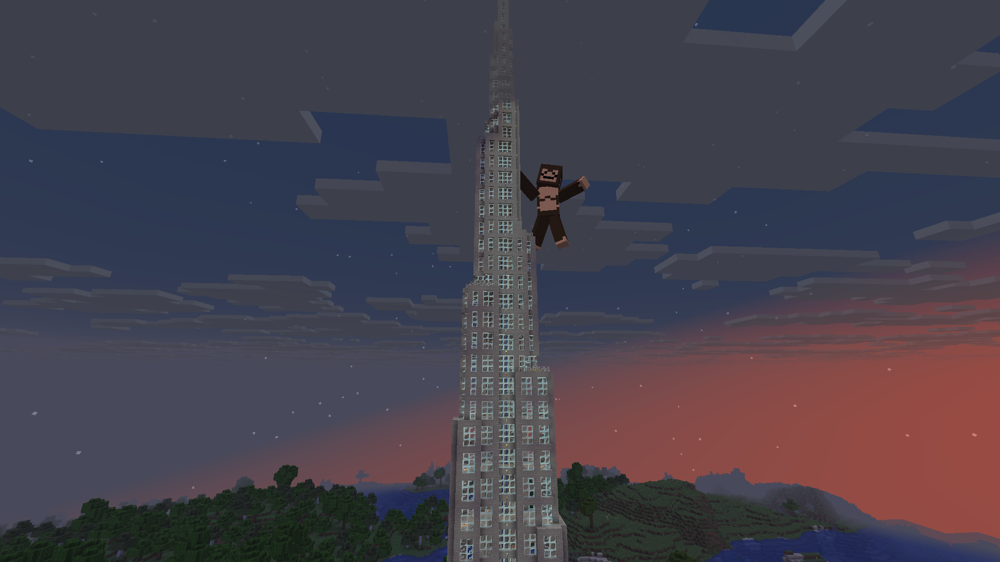

# History

***

## **The beginning of beginnings**

The history of the server began with a random game with random players along with LazyLX on a discord server on the latest version of Minecraft. The world was hosted on the computer of one of the random players, for LazyLX and me this was inconvenient and we asked it to play while the host was offline. Later, the idea came up to create a server in this world.

### Season 0 \[**Before the Big Bang]**


<mark style="color:$primary;">Season 0 starts 21.06.2025 and ended 22.08.2025</mark>


During the first time of the [Season 0](history.md#season-0-before-the-big-bang), the world was hosted on my home computer, which was inconvenient for both me and the players. 20.07.2025 hosting was purchased and the world was transferred to a server in Germany.

#### Whitelist (11):

<mark style="color:$primary;">Marshmachell, LazyLX, Falanta, zeinoxl, \_trpplvn\_ DasDiamond58, bth123, Pizdaeb4324, TwKraystall, Lays\_Pr1nglesss, Hendry69</mark>

#### Screenshots:



<figure><figcaption></figcaption></figure>



<figure><figcaption></figcaption></figure>



<figure><figcaption></figcaption></figure>



<figure><figcaption></figcaption></figure>



<figure><figcaption></figcaption></figure>



<figure><figcaption></figcaption></figure>



<figure><figcaption></figcaption></figure>



<figure><figcaption></figcaption></figure>



<figure><figcaption></figcaption></figure>



<figure><figcaption></figcaption></figure>



***

### Season 1 \[**The dawn of time**]


<mark style="color:$primary;">Season 1 starts ??.12.2025 and ended ??.??.202?</mark>


_Soon it story will be written.._
